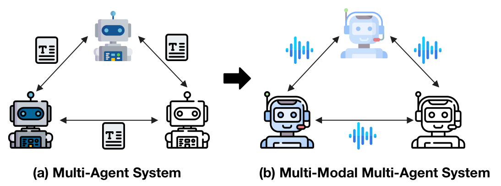
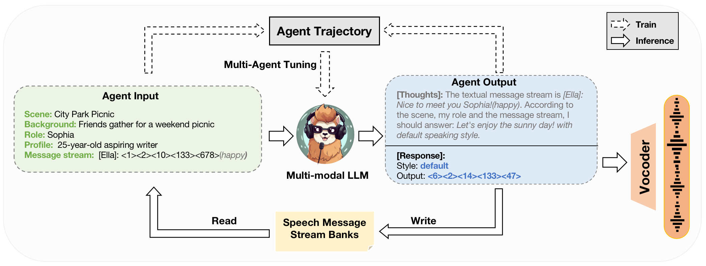

# SpeechAgents: Human-Communication Simulation with Multi-Modal Multi-Agent Systems

   

      

## Introduction
SpeechAgents is a **multi-modal LLM based multi-agent system** designed for human communication simulating. Different from current LLM-based multi-agent systems, SpeechAgents utilizes **multi-modal LLM as the central control for individual agent** and **employ multi-modal signals as the medium for exchanged messages among agents**.  Additionally, we propose **Multi-Agent Tuning** to enhance the multi-agent capabilities of LLM without compromising general abilities. To strengthen and evaluate the effectiveness of human communication simulation, we build the **Human-Communication Simulation Benchmark**. 
SpeechAgents demos are shown in our [project page](https://0nutation.github.io/SpeechAgents.github.io/). As shown in the demos, SpeechAgents can generate human-like communication dialogues with consistent content, authentic rhythm, and rich emotions, which can accomplish tasks such as **drama creation and audio novels generation**.

      
    llustration of training and inference process of an individual agent in SpeechAgents.

## Code 
We will soon open-source our codes and models, stay tuned!

## Demo
https://github.com/0nutation/SpeechAgents/assets/89269252/13112de9-5c1b-4e4d-9655-4499d9fc610a

## Citation
